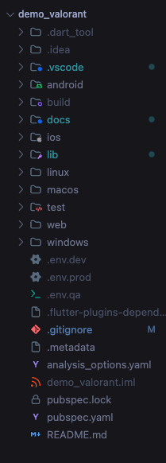
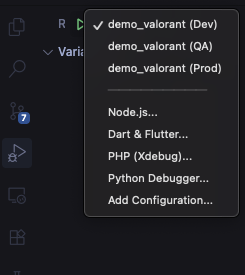
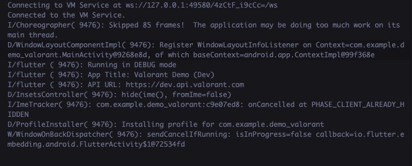

# Configuración de Entornos en VS Code

Esta guía te ayuda a configurar y correr el proyecto `demo_valorant` simulando diferentes ambientes (Dev, QA, Prod) directamente desde Visual Studio Code.

## 1. Archivos de Entorno

El proyecto usa archivos `.env` en la raíz para manejar las variables de cada ambiente.

- **`.env.dev`**: Desarrollo (Debug activo, API de dev).
- **`.env.qa`**: QA (Debug activo, API de pruebas).
- **`.env.prod`**: Producción (Debug inactivo, API real).

> **Ojo:** Estos archivos están ignorados en git por seguridad. Asegúrate de tenerlos creados en tu equipo.



## 2. Ejecutar desde VS Code

Ya dejamos configurado el archivo `.vscode/launch.json` para que no tengas que escribir comandos largos.

### Pasos para correr la app:

1.  Abre la pestaña **Run and Debug** (el ícono de "Play" con un bicho) o usa `Cmd+Shift+D`.
2.  Arriba a la izquierda verás un selector.
3.  Elige el ambiente que quieras probar:
    - `demo_valorant (Dev)`
    - `demo_valorant (QA)`
    - `demo_valorant (Prod)`



4.  Dale al botón de **Play** (o presiona `F5`).

VS Code se encarga de inyectar automáticamente el archivo `.env` correcto usando `--dart-define-from-file`.

Si todo va bien, verás en la consola de depuración los logs confirmando el ambiente:



## 3. Ejecutar desde Terminal

Si eres más de terminal, también puedes lanzarlo “a mano” con estos comandos:

**Desarrollo:**

```bash
flutter run --dart-define-from-file=.env.dev
```

**QA:**

```bash
flutter run --dart-define-from-file=.env.qa
```

**Producción:**

```bash
flutter run --dart-define-from-file=.env.prod
```

## 4. ¿Cómo se usan las variables en el código?

Todo se maneja desde la clase `EnvConfig`. Si necesitas agregar una nueva variable o usar una existente, hazlo así:

```dart
import 'package:demo_valorant/core/config/env_config.dart';

// Ejemplo
print(EnvConfig.apiUrl);
```

Simple, ¿no?
